<p align="center">
  
</p>

<!-- Replace # links below with your real profiles -->
[](https://linkedin.com/in/mahdi-mghs)
[](mailto:micrmahdi@email.com)
[](https://github.com/Mahdi-mghs)

</div>

---

## 🧬 System Status

```yaml
Name:       Mahdi
Role:       Data Engineer / PM
Location:   Khorasan razavi, Iran
Focus:
  - Data Engineering & Pipeline Architecture
  - Stream Processing (Kafka, Spark)
  - Web Crawling & Automation
Currently:
  - Building: kafka-pipeline (real-time stream processor)
  - Learning: Delta Lake & Iceberg table formats
  - Exploring: ESP32 & Microcontrollers
Open To:    Collaborations, freelance data projects
Reach Me:   micrmahdi@email.com
Fun Fact:   I think of data pipelines the way architects think of bridges
```

---

## 🛠️ Utility Lab

> Production tools built to solve real-world problems.

| Project | Stack | Description |
|---------|-------|-------------|
| 🏦 [Bank-Automation](https://github.com/Mahdi-mghs/Bank-Automation) |  | Automates repetitive banking workflows — fill your card info and try get captcha automatically |

---

## 🚀 Idea Reactor

> Experimental projects at the edge of what I'm learning.

| Project | Stack | Description |
|---------|-------|-------------|
| ⚡ [SCPipeline](https://github.com/Mahdi-mghs/SCPipeline) |  | End-to-end data processing pipeline — ingestion, transformation, and sink |
| 🌊 [kafka-pipeline](https://github.com/Mahdi-mghs/kafka-pipeline) |  | Real-time streaming architecture experiment with Kafka producers and consumers |
| 📈 [Retrieve_Market](https://github.com/Mahdi-mghs/Retrieve_Market) |  | Market data collector — fetches, normalizes, and stores financial time-series |
| 🔥 [SparkScalaTraining](https://github.com/Mahdi-mghs/SparkScalaTraining) |   | Apache Spark playground in Scala — RDDs, DataFrames, and batch jobs |
| 📘 [Dictionary-App](https://github.com/Mahdi-mghs/Dictionary-App) | Java | Working around develop android app

---

## 🗄️ Time Capsule

> Earlier work that shaped my engineering mindset.

| Project | Stack | Description |
|---------|-------|-------------|
| 🎬 [IMDBScraper](https://github.com/Mahdi-mghs/IMDBScraper) |  | Crawls IMDB for movie metadata — ratings, cast, genres — and stores structured output |
| 📚 [Book_Bank](https://github.com/Mahdi-mghs/Book_Bank) |  | Personal learning project — book inventory and tracking system |
| 🌐 [First-FE](https://github.com/Mahdi-mghs/First-FE) |  | My first frontend project — a milestone worth remembering |
| 🕷️ [pinterest-crawler](https://github.com/Mahdi-mghs/pinterest-crawler) |  | Web crawler for Pinterest image and metadata extraction |

---

## ⚙️ Tech Arsenal

**Languages**

<p align="left">

</p>

**Data & Streaming**

<p align="left">


</p>

**DevOps & Databases**

<p align="left">

</p>

---

## 🐍 Contribution Snake

<p align="center">
  
</p>
